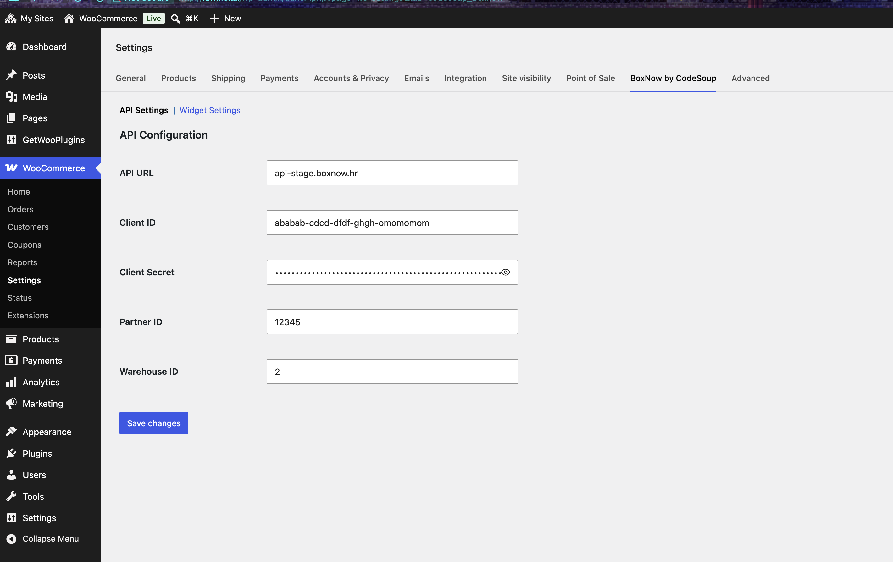
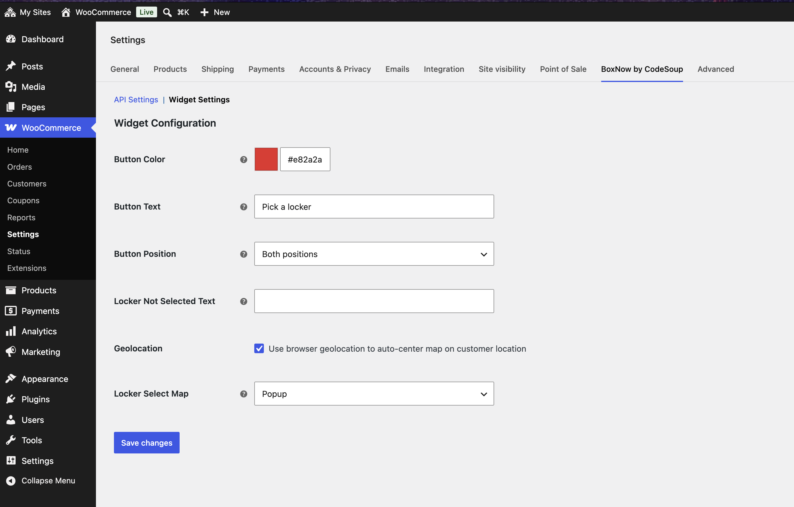

# BoxNow Delivery for WooCommerce

WordPress plugin that integrates BoxNow locker delivery service with WooCommerce for Croatian market.

## Disclaimer

This is an unofficial plugin. The developer of this plugin is not affiliated with, endorsed by, or sponsored by BoxNow.

This plugin is provided "as is" without warranty of any kind, express or implied, including but not limited to the warranties of merchantability, fitness for a particular purpose and noninfringement.

In no event shall the authors or copyright holders be liable for any claim, damages or other liability, whether in an action of contract, tort or otherwise, arising from, out of or in connection with the plugin or the use or other dealings in the plugin.
Use at your own risk. Test thoroughly in a staging environment before production use.

## Requirements

- WordPress 6.0 or higher
- WooCommerce 8.0 or higher
- PHP 8.1 or higher
- BoxNow API credentials

## Installation

1. Upload plugin folder to `/wp-content/plugins/`
2. Activate via WordPress admin panel
3. Configure API credentials in WooCommerce → Settings → BoxNow

## Configuration

### API Settings

Navigate to WooCommerce → Settings → BoxNow → API Settings

**Required:**

- **API URL** - BoxNow API endpoint (default: api.boxnow.hr)
- **Client ID** - BoxNow API client identifier
- **Client Secret** - BoxNow API client secret
- **Partner ID** - BoxNow partner identifier
- **Warehouse ID** - Comma-separated warehouse IDs for origin locations

### Widget Settings

Configure locker selection widget display options.

**Available Options:**

- **Button Color** - Color for locker selection button
- **Button Text** - Custom text for locker selection button
- **Button Position** - Checkout placement position
- **Locker Not Selected Text** - Error message when checkout attempted without locker selection
- **Geolocation** - Use browser geolocation to center map on customer location
- **Locker Select Map** - How the locker selection map appears

**Locker Select Map Options:**

- **Popup** - Opens locker map in modal overlay (default)
- **Embedded** - Displays locker map inline on checkout page
- **Custom** - Manual placement via shortcode `[codesoup_boxnow_pick_locker]` - full control over map positioning

## Screenshots

### API Settings

Configure BoxNow API credentials and warehouse settings.



### Widget Configuration

Customize locker selection button and map display options.



## Features

### Shipping Method

- Adds "BoxNow Locker Delivery" shipping method to WooCommerce
- Configurable shipping cost
- Tax class support
- Min/max order amount restrictions

### Locker Selection

- Interactive locker map widget on checkout
- Search by address or postcode
- Store selected locker with order

### Order Processing

- Automatic parcel creation when order completes
- Parcel tracking via order meta
- Store locker details with order

### API Integration

- Create delivery requests
- Cancel parcels
- Retrieve parcel status
- Print parcel labels (PDF)

## Order Meta Keys

Plugin stores following meta data on orders:

**Locker Information:**

- `_boxnow_locker_id` - Selected locker ID
- `_boxnow_locker_name` - Locker name
- `_boxnow_locker_address` - Locker street address
- `_boxnow_locker_city` - Locker city
- `_boxnow_locker_postcode` - Locker postal code
- `_boxnow_locker_country` - Locker country code

**Parcel Information:**

- `_boxnow_parcel_id` - BoxNow parcel tracking ID
- `_boxnow_parcel_ids` - Array of parcel IDs (for multiple parcels)
- `_selected_warehouse` - Origin warehouse ID

## Filters

### `codesoup_boxnow_shipping_method_title`

Modify shipping method title displayed on checkout.

```php
add_filter( 'codesoup_boxnow_shipping_method_title', function( $title ) {
    return 'Locker Pickup';
} );
```

### `codesoup_boxnow_shipping_cost`

Modify shipping cost calculation.

```php
add_filter( 'codesoup_boxnow_shipping_cost', function( $cost, $package ) {
    return 5.00;
}, 10, 2 );
```

### `codesoup_boxnow_api_request_args`

Modify API request arguments before sending.

```php
add_filter( 'codesoup_boxnow_api_request_args', function( $args, $endpoint ) {
    $args['timeout'] = 30;
    return $args;
}, 10, 2 );
```

## Actions

### `codesoup_boxnow_order_completed`

Fires after BoxNow order is marked complete and parcel created.

```php
add_action( 'codesoup_boxnow_order_completed', function( $order_id, $parcel_id ) {
    // Custom logic
}, 10, 2 );
```

### `codesoup_boxnow_parcel_cancelled`

Fires after parcel is cancelled.

```php
add_action( 'codesoup_boxnow_parcel_cancelled', function( $parcel_id, $order_id ) {
    // Custom logic
}, 10, 2 );
```

## Development

### File Structure

```
includes/
├── core/                    # Core plugin classes
├── constants/               # Constant definitions
├── integrations/            # Third-party integrations
│   └── woocommerce/         # WooCommerce specific
├── services/                # Business logic
│   ├── api/                 # BoxNow API client
│   ├── orders/              # Order handling
│   └── ajax/                # AJAX handlers
└── traits/                  # Reusable traits
```

### Logging

Plugin uses WooCommerce logging system. Logs written to WooCommerce log file.

View logs: WooCommerce → Status → Logs → Select `codesoup-boxnow-*`

## Support

Report issues at: https://github.com/code-soup/woo-box-now-delivery-croatia/issues

## License

GPL-3.0+

This program is free software: you can redistribute it and/or modify it under the terms of the GNU General Public License as published by the Free Software Foundation, either version 3 of the License, or (at your option) any later version.

This program is distributed in the hope that it will be useful, but WITHOUT ANY WARRANTY; without even the implied warranty of MERCHANTABILITY or FITNESS FOR A PARTICULAR PURPOSE. See the GNU General Public License for more details.

You should have received a copy of the GNU General Public License along with this program. If not, see https://www.gnu.org/licenses/gpl-3.0.html
